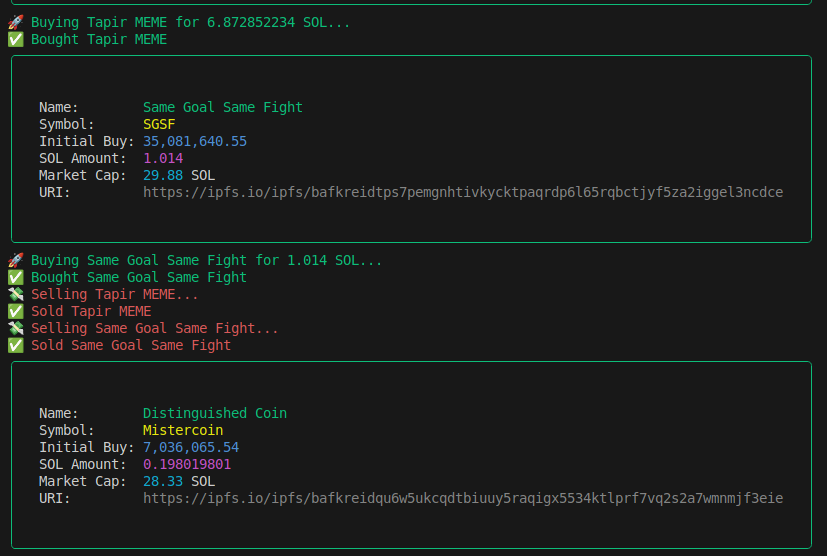

# 🤖 Pump.fun Auto-Trading Sniper

### A powerful, terminal-based Pump.fun auto-trading bot built with Node.js.
### It monitors newly launched tokens in real time, auto-buys based on your custom SOL threshold, and auto-sells after a delay.

📌 Features
✅ Real-time token tracking via WebSocket

✅ Auto-buy based on your defined SOL threshold

✅ Auto-sell after configurable delay

✅ Supports .env private key (no hardcoding)

✅ Mock trade logic included (plug in Jupiter SDK easily)

🛠 Installation
```
git clone https://github.com/yourname/pumpfun-trading-bot.git
cd pumpfun-trading-bot

# Install required packages
npm install
```



🛠 Configuration

Load .env file
```
PRIVATE_KEY=
BUY_THRESHOLD_SOL=0.05
SELL_DELAY_MS=100
SUBSCRIBE_ADDRESS=51dX3g5z7b6f8e9a2c3d4e5f6b7a8b9c0d1e2f3g4
RPC_URL=https://api.mainnet-beta.solana.com
WS_URL=wss://api.mainnet-beta.solana.com
```

▶️ Run the Bot
```
npm start
```
Built by Tuan Tran
Twitter: @tuandev.aglietech
Email: tuandev@aglietech.com
